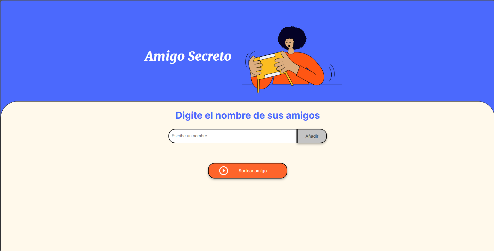
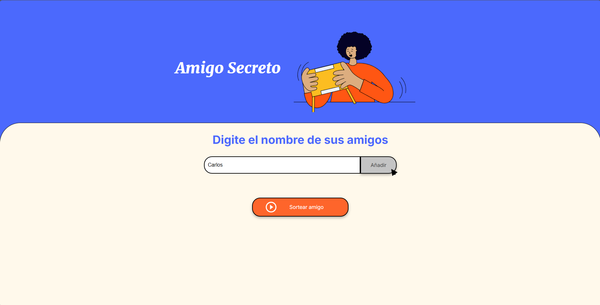
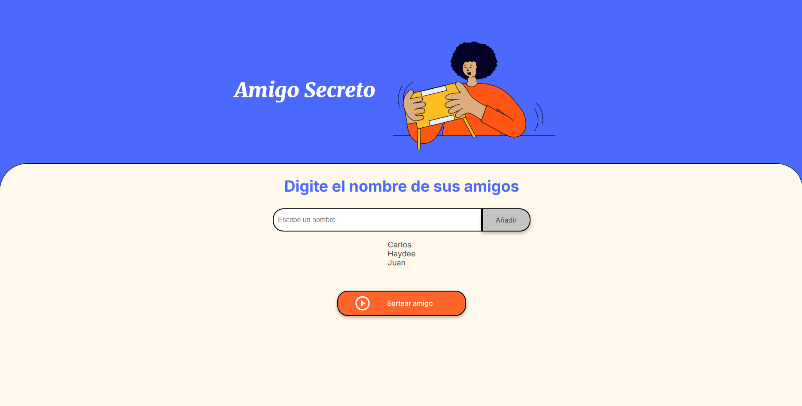
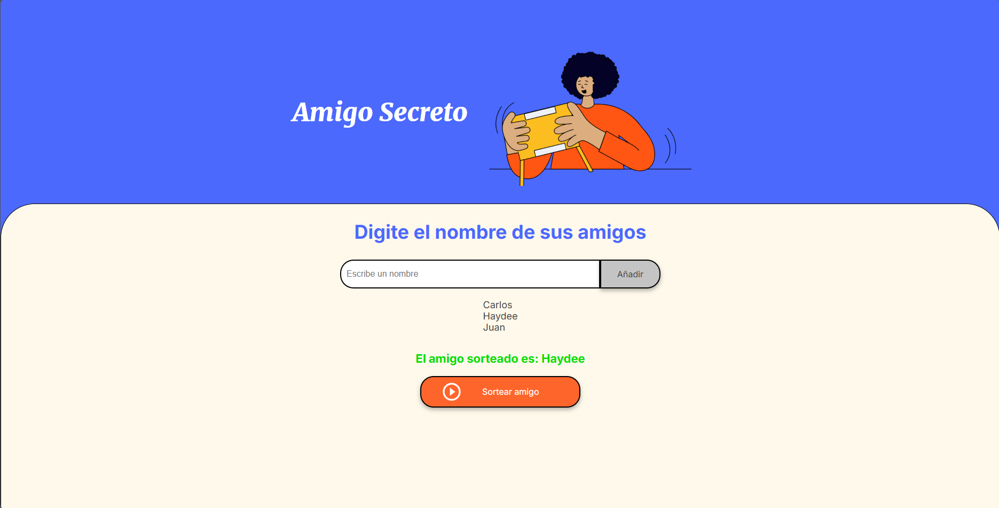
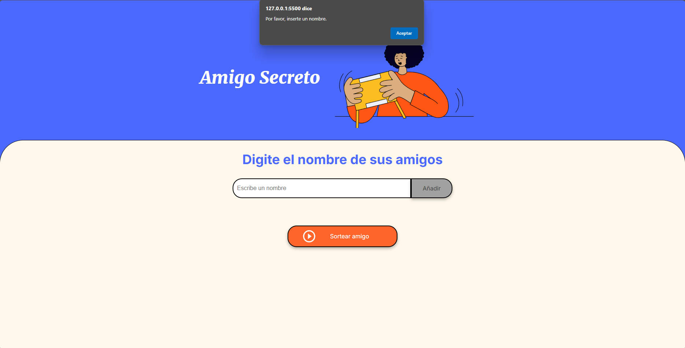

# Challenge Amigo Secreto

## Descripción
**Challenge Amigo Secreto** es una aplicación simple que permite ingresar nombres de personas y, al presionar el botón "Sortear", selecciona aleatoriamente a un "amigo secreto".

Si se intenta agregar un nombre sin ingresar texto, la aplicación muestra un mensaje de advertencia indicando que se debe insertar un nombre.

## Tecnologías utilizadas
- **HTML**: Estructura de la aplicación.
- **CSS**: Diseño y estilos.
- **JavaScript**: Lógica de funcionamiento.

## Instalación y ejecución

1. **Descarga el proyecto desde GitHub**  
   Clona el repositorio desde el siguiente enlace: [Challenge Amigo Secreto](https://github.com/CarlosVF2003/challenge-amigo-secreto.git)

2. **Abre la carpeta del proyecto**  
   Utiliza **Visual Studio Code** u otro editor de texto de tu preferencia.

3. **Ejecuta la aplicación**  
   Abre el archivo `index.html` en tu navegador web.

## Ejemplo de uso

1. **Ingreso de nombre**  
   Ingresa un nombre en el campo de texto.  
   

2. **Agregar el nombre**  
   Presiona el botón "Añadir" para agregar el nombre a la lista.  
   

3. **Repetir el proceso**  
   Agrega más nombres repitiendo el proceso.  
   

4. **Realizar el sorteo**  
   Presiona el botón "Sortear" para seleccionar aleatoriamente a un "amigo secreto".  
    

> **Nota:** Si no ingresas un nombre antes de presionar "Añadir", se mostrará un mensaje de advertencia. Si no sabes qué nombre poner, puedes solicitar sugerencias.

   

## Autor
- **Carlos Vera**

## Licencia
Este proyecto no cuenta con licencia, ya que es parte de un challenge.
